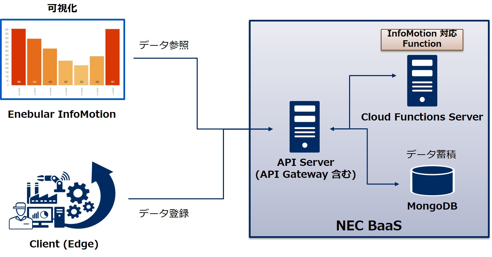

NEC BaaS Custom API for Enebular InfoMotion
===========================================

概要
----

株式会社 ウフル が提供する [Enebular](https://enebular.com) [InfoMotion](https://docs.enebular.com/ja/InfoMotion/Introduction.html) から NEC モバイルバックエンド基盤(NEC BaaS) に REST API でアクセスしてデータを取得するためのCloudFunctions カスタムAPIです。
本APIを利用することで、NEC BaaSに蓄積したIoTデータなどのJSONオブジェクトデータを、InfoMotionを使って可視化することができます。

以下にシステム構成図を示します。

# カスタムAPI登録
NEC BaaS からJSONオブジェクトデータを取得するカスタムAPIを登録します。
以降の説明でテナント、アプリケーション、ユーザの入力を行うため、事前に登録してください。
また、テナント情報のCORS設定を有効にし、CORS許可ドメインにInfoMotionのドメインを追加してください。

## API定義登録
本プロジェクトに格納されているAPI定義を登録します。
api.yamlの内容をコピーし、デベロッパーコンソールのAPI Gatewayから登録します。
Basic認証を行う場合は、x-acl の値を実行許可するユーザIDやグループ名に設定することを推奨します。以下に例を示します。

    x-acl:
       - 1234567890abcdefxxxxxxxx // 特定ユーザを指定する場合
       - g:infomotion // infomotion グループに所属するユーザを指定する場合
       - g:authenticated // 認証ユーザ全員を指定する場合

## Function定義登録
本プロジェクトに格納されているFunction定義を登録します。
function.yamlの内容をコピーし、デベロッパーコンソールのCloud Functions > Functionsから登録します。登録する際の名前はfunction.yamlの1行目に記載されているFunction名を入力してください。

## ユーザコード登録
ユーザコードは、コンパイル済みバイナリをGitHubより取得し、登録してください。

URL：https://github.com/nec-baas/baas-infomotion

### ビルド
ユーザコードをソースからビルドする場合は、以下のコマンドで実行します。

    $ mvn verify

ビルドが完了するとtargetフォルダ配下にinfomotion-7.5.0-SNAPSHOT-cloudfn.tar.gzが作成されます。

### バケット作成
デベロッパーコンソールのファイルバケットからバケット名をCUSTOM_CODEとしてファイルバケットを作成します。
ACLの設定は、バケットACL、コンテンツACL共に全ての権限を空に設定してください。

### ファイル登録
ファイルバケット一覧から作成したファイルバケットを選択し、infomotion-7.5.0-SNAPSHOT-cloudfn.tar.gzを登録してください。

# アクセス方法
enebular InfoMotion からの NEC BaaS カスタムAPI の呼び出し方法について記述します。
カスタムAPI の呼び出しには以下の設定を行います。

* InfoType
* DataSource
* InfoMotion

## InfoType設定
infomotion-toolを使用し作成、もしくは以下のURLから任意のInfoTypeを選択します。 ここではURLにあるenebularが提供するlinechartを使用します。

URL：https://enebular.com/discover

## DataSource設定
enebularのプロジェクトダッシュボードからDataSourceを追加します。

DataSource設定画面では以下の項目が設定できます。下記項目に適当な値を設定します。

|設定項目             |説明                                                                             |
|:--------------------|:--------------------------------------------------------------------------------|
|Title                |任意のタイトル                                                                   |
|DataSource Type      |NEC-BaaS                                                                         |
|Endpoint             |https://{APIサーバホスト名}/api/1/{テナント名}/api/{API名}/{サブパス}?{検索条件} |
|App Id               |NEC BaaSのアプリケーションID                                                     |
|App Key              |NEC BaaSのアプリケーションキー                                                   |
|Username (optional)  |NEC BaaSに登録済みのユーザ名                                                     |
|Password (optional)  |NEC BaaSに登録済みユーザのパスワード                                             |

* テナントID、アプリケーションID、アプリケーションキーはNEC BaaSのデベロッパーコンソール上で確認してください。
* API名はinfomotionを指定してください。
* サブパスには/search/{バケット名}を指定してください。バケット名は使用するバケットを指定してください。
* 検索条件の設定は任意となります。オブジェクトクエリの検索条件と同フォーマットでwhereが指定できます。
* DataSource TypeはNEC BaaSとの連携を行うため、NEC-BaaSを指定してください。

## InfoMotion設定
enebularのプロジェクトダッシュボードからInfoMotionを追加します。

追加したInfoMotionを開き、Manage Graphsをクリックします。
右側にグラフを追加するためのメニューが表示されるのでCreate Graphをクリックします。

下記項目に適当な値を設定し、Addをクリックしてグラフを追加してください。

|設定項目               |説明                               |
|:----------------------|:----------------------------------|
|Name                   |任意の名前                         |
|Select InfoType        |登録したInfoType                   |
|Select Data DataSource |登録したDataSource                 |
|label                  |凡例                               |
|value                  |値のキー名                         |
|limit                  |表示件数                           |
